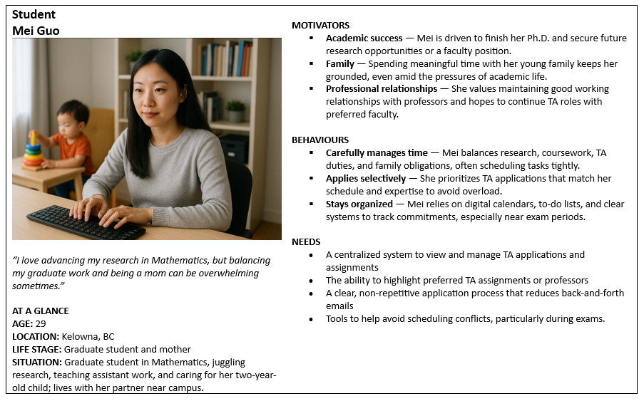
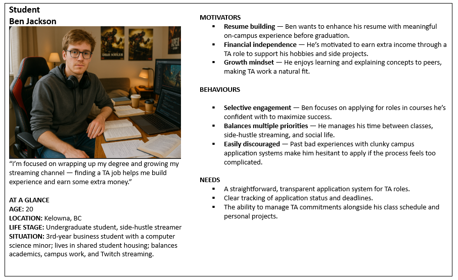
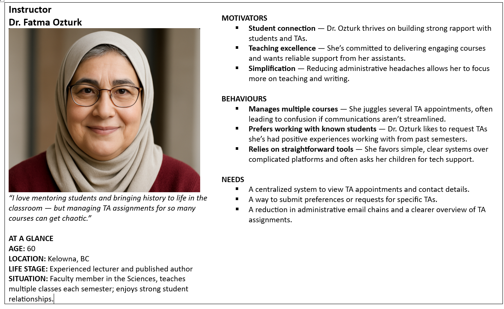
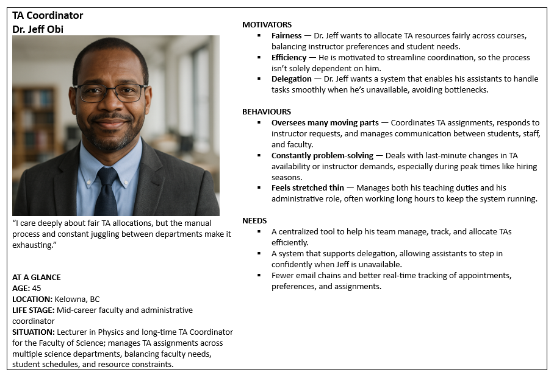
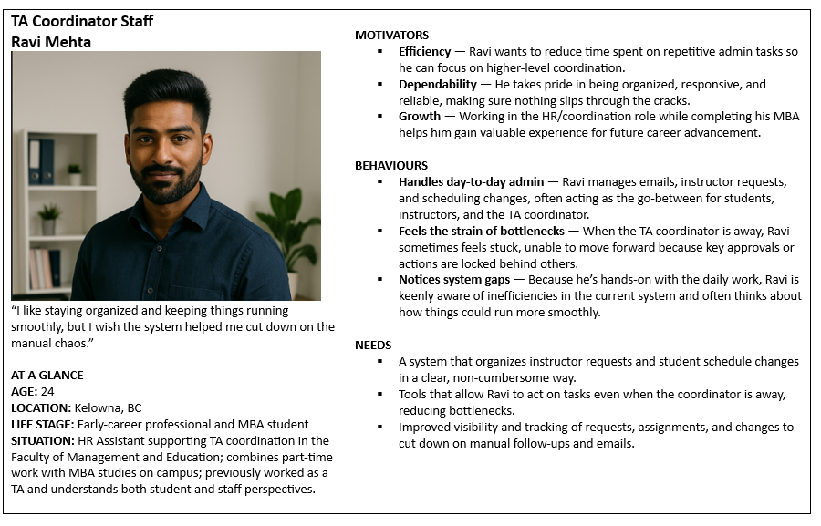

# Project Plan for TA Allocation and Management System

**Team Number:** 2

**Team Members:**
- Naman Arora
- Ariana Rice
- Varun Patel
- Reyhan Reginald
- Aadil Shaji
- Devstutya Pandey
- Shan Richards

## Overview:

### Project purpose or justification (UVP)

The purpose of this software is to streamline the process of TA allocation and management within the CMPS department. It addresses current inefficiencies and fragmentation by consolidating the many moving pieces into a single, easy-to-use platform. No more endless back-and-forth communication; no more sifting through folders on your computer to no avail; and, as a student, no more starting from scratch every time you apply. It further offers visualization and reporting tools that are informative, yet intuitive. Overall, our software brings clarity and coordination to a process that desperately needs it, improving the experience for instructors and students alike.

### High-level project description and boundaries

This platform will support the management and allocation of Teaching Assistant (TA) positions.

**Students** can create an account and apply to open TA positions. They can track the status of their applications and accept/decline offers for TA positions. Upon acceptance, their assigned TA schedule will be visible in a calendar.

**Instructors** can create an account and submit TA requests for the courses they are teaching (indicating the number of TAs needed, preferred skills, or other criteria), and view the final list of TAs allocated to their courses.

**TA Coordinators and Staff (Admin Users)** can receive and review TA requests from instructors, post open TA positions, manage the allocation of TAs to courses.

### System Boundaries

The system will not :  
- Include automated TA matching or optimization algorithms (e.g., no automatic balancing or best-fit recommendation engine).  
- Include an interview management system (if instructors want to interview applicants, this would be managed outside the platform; the system assumes that final TA assignments are handled/administered by coordinators).  
- Manage payroll, contracts, or other HR functions.  
- Handle communication channels beyond basic status updates and notifications within the system (i.e., no integrated email or chat for negotiations or detailed discussions).
- Integrate with pre-existing UBCO information systems.
- Include the ability for Instructors to select or interview preferred Teaching Assistants for their courses. 

### Measurable project objectives and related success criteria (scope of project)

- Deploy Final Web Application by August 2025
  - Success Criteria: At least 95% of the identified functional requirements are fully implemented, tested, and approved by the client by the project deadline.
  - Measured By: Final client feedback, user testing reports, and issue tracking metrics.

- Maintain Rigorous Pull Request (PR) Review Process
  - Success Criteria: 100% of merged PRs must be reviewed by at least two other team members (authors may not review their own code).
  - Measured By: Git commit history and PR review logs showing comments, approvals, and feedback iterations.

- Complete MVP by June 27, 2025
  - Success Criteria: A complete, working Minimum Viable Product (MVP) along with basic documentation is merged into the main branch by June 27, 2025 at EOD.
  - Measured By: Git repository logs, team checklist, and internal feature audit confirming MVP completeness and stability.

## Users, Usage Scenarios and High Level Requirements 

### Users Groups:

Three pimrary users were identified for the system and proto-personas were created for each.

- Students
  
 
- Instructor
   
- TA Coordinators & Staff
   
   

### Envisioned Usage

##### Student Scenario

Jill is an undergraduate student who hopes to TA a CMPS course next school year. She creates an account and then logs in using her credentials. Then, she begins her application, adding the required personal information and uploading documents like her resume, her availability and other documents. She chooses to apply to a few courses she thinks she is a good fit to and submits her application. After that, she navigates to her profile page and sees that her application has been successfully submitted, so she logs out. Some days later, Jill is curious about the status of her TA application, so she logs into her account. After navigating to her profile page, she sees that she has an offer. She reviews the details of her assignment and then checks her planner to verify that it will work with her schedule. Seeing that it does, she decides to accept the offer.

##### Instructor Scenario

Dr. Nguyen, a computer science professor, logs into the system prior to the start of a new academic year. He navigates to his profile and updates his courses to reflect what he will be teaching in each term. He then uses the system to communicate his TA requirements for each course, including preferences such as the desired number of TAs and whether they should be undergraduate or graduate students. The system logs his input for consideration during the allocation process. After entering his information, Dr. Nguyen logs out for the day.

A week later, Dr. Nguyen logs back in and navigates to his profile, where he sees the finalized TA allocations for his courses. He can view and export the details, which include the names and contact information of the assigned TAs. After retrieving the information he needs, he logs out. With this information, Dr. Nguyen drafts an email to schedule onboarding meetings with his newly appointed TAs.

##### TA coordinator/Admin: 

Dr. Mavis, a statistics professor who oversees TA appointments within her department, logs into the system to get a head start on TA planning. First, she uploads the finalized list of courses and corresponding lab sections for the upcoming school year. Then she navigates to her profile and edits her courses to reflect what she will be teaching this year. For each course, she indicates how many and what type (undergraduate vs. graduate) of TAs she requires. She then logs out to catch up on some emails. Some weeks later, the day after the application deadline, Dr. Mavis logs back into the system. Today she aims to complete all assignments for first year computer science courses. She navigates to her Admin view and sees that a number of professors have made TA requests. She views them one by one to get a sense of the department’s needs. Then she navigates to the Student Applications and … Once she has finished appointing TAs for the time being, she logs out of the system and will return tomorrow to continue making appointments and monitoring student responses.

### Requirements:

#### Functional Requirements:
##### Login & Registration
- System will enable users (Students, Instructors, and TA Coordinators) to create accounts using an email and a password.
- System will be able to authenticate users when they log in using their email and password.
- System will allow authenticated users to logout.
- System will allow users (Students, Instructors, and TA Coordinators) to reset their password.

##### File Processing for Previous TA
- System will be able to receive files containing previous TA appointments (file format will be specified at a later date, but assume CSV ← Instructor's advice).
- System will be able to process files it receives and securely store the data.

##### Content Access
- System will only let authenticated users access content pertaining to scheduling, allocation, and management.
- System will let all users access information on available positions.
- System will allow authenticated TA/Student users to access web forms for job applications.

##### TA/Student Dashboards and Data Modification
- System will provide role-specific dashboards for authenticated users.
- System will allow TA/Student users to create their availability for both terms.
- System will allow TA/Student users to update their availability for both terms.
- System will allow TA/Student users to update their transcripts.
- System will accept and store resume documents from TA/Student users (should accept .docx, .pdf, .doc, etc.).
- System will allow TA/Student users to update all of their documents.
- The system will enforce document size (<50 MB) to ensure data consistency.
- The system will allow students to download a PDF summary of their TA appointment history.

##### TA/Student Functionality
- System will allow students to complete their profiles with their names, UBCO student number, degree program, year of study, department, preferred name (optional), major program of study, minor programs, and undergrad/grad status.
- System will allow students to apply for open TA positions.
- System will only allow the student to submit one application per open TA position.
- System will allow TA/Student users to accept or decline an offer for a TA position.
- System will notify TA/Student users if they receive an offer from an admin.
<!-- System will track hours worked for TAs (commented out as in original) -->
- System will provide a calendar view for TAs to view their schedule.
- The system will allow students to withdraw applications before they are offered a position.

#### Instructor Functionality
- System will allow instructors to submit TA requirements/preferences (e.g., number of TAs, type, skills).
- System will notify the instructor if a TA/Student has been hired for their class.
- System will allow instructors to assign a hired TA/Student a duty (class help, exam invigilation, labs, etc.). (?)
- System will allow instructors to export data relevant to their courses or assigned TAs (specific formats to be decided).

#### Administrator (Admin) Functionality
- System will allow admin users to offer positions to TA/Student users.
- System will allow administrators to create job openings.
- System will allow administrators to update job openings.
- System will allow administrators to set deadlines for TA applications.
- System will allow administrators to view historical TA assignments for different courses.
- System will allow administrators to export system data (specifics to be decided).
- System will allow administrators to assign instructors to courses.
- System will allow administrators to manage appointment changes (e.g., reassign or revoke TA assignments).
- System will allow administrators to send system-generated notifications or bulk communications to instructors and TAs.

##### Instructor and Admin Dashboards
- System will allow instructors to see all of their courses.
- System will provide instructors with a hierarchical view of their courses and assigned TAs, similar to an organizational chart.
- System will allow instructors to see the availability of their TAs.
- System will provide access to the catalogue of courses for the admin.
- System will provide visualizations of TA allocations for the instructor.

#### Non-functional Requirements:

- System will have a responsive UI that fits all desktop/laptop screens and resolutions.
- System will have a simple and easy-to-use UI.
- System will encrypt all personal data prior to storing (student numbers, names, passwords, etc.).
- System will be written to prevent all injection attacks.
- System must work on any environment and operating system.
- System must follow a modular architecture to allow for future expansion to other departments.
- System will incorporate data privacy protections aligned with institutional and legal standards.

#### User Requirements:

##### Students 
1. Students will be able to create an account using email
2. Students will be able to log in using email and password
3. Students will be able to reset their password in case they forget.
4. Students will be able to complete their profile with full name, Student Number, Degree Program, Year of Study, Department, Preferred Name (Optional), Major Program of Study, Minor programs, if they are a undergrad/grad student
5. Students will be able to upload their resume, transcripts and cover letter(optional)
6. Students will be able to update their profile at any time
7. Students will be able to delete their profile/ account.
8. Students will be able to delete and reupload documents if needed
9. Students will be able to indicate the courses which they have previously TA’d (if any) and which term - (not sure most prolly the Admin uploading the past records of previous TAs.)
10. Students will be able to give preferences if applying for multiple courses
11. Students will be able to enter their availability using a calendar interface
12. Students will be able to modify their availability using the calendar interface.
13. Students will be able to indicate how many hours per week they are available to work
14. Students will be able to see the available TA positions for the upcoming term
15. Students will be able to filter/search TA positions by course code, instructor or department
16. Students will be able to see full posting details (instructor name, workload type, number of TA needed)
17. Students will be able to apply for open TA positions using existing profile and documents.
18. Student will be able to cancel/withdraw an application for a TA position.
19. Students will be notified when application is successfully submitted.
20. Students will be able to see the status of all their applications (Pending, Accepted, Rejected)
21. Students will receive an email confirmation when their application status changes.
22. Students will be able to accept/decline an appointment once offered.
23. Students will be able to download a PDF summary of their appointment history
24. Students will be able to visualize their current appointments on a calendar.

##### Instructors 

1. Instructors will be able to login using their credentials
2. Instructors will be able to reset their password if they forget
3. Instructors will have a personalized dashboard showing courses they are assigned to teach
4. Instructors will be able to view/edit their profile (name, title, contact info)
5. Instructors will be able to submit a TA request for each course they teach - indicating the number of TAs required,TA Type(Undergrad, Grad), Needed Skills, Needed Courses
6. Instructors will be able to edit TA request up to a defined deadline.
7. Instructors will be able to view the list of TAs assigned to each of their courses after appointments are made by the TA Coordinator.
8. Instructors will be able to view TA profiles, including their contact information

##### TA Coordinators & Staff 
1.  TA Coordinators will be able to login using their credentials
2. TA Coordinators will be able to reset their passwords in case they forget
3. TA Coordinators will have access to an admin dashboard with full management capabilities
4. TA Coordinators will be able to upload or manually add the list of courses offered in the upcoming term including - course code, instructor, term (Fall, Winter, Summer), Lab Tutorial/Sections                            
5. TA Coordinators will be able to assign instructors to each course
6.TA Coordinators will be able to view submitted 
7. TA requests from Instructors.
8.  TA Coordinators will be able to create and post TA job openings for specific courses.
9.  TA Coordinators will be able to update the details of posted positions, including - number of TAs required, Required Qualifications, Application Deadline
10. TA Coordinators will be able to archive or remove postings once filled =
11. TA Coordinators will be able to view all student applications for each TA position
12. For each application they can view - Full Student Profile, Uploaded Documents (Resume, Transcript, Optional Cover Letter) , Course Preferences, Availability Calendar, Previous TA Experience
13. TA Coordinators will be able to appoint selected students to specific TA roles
14. TA Coordinators will be able to manage changes to an appointment (reassigning or revoking an appointment)
15. TA Coordinators will be able to upload CSV files of previous TA appointments to seed data into the system 

#### Technical Requirements:
The system will be implemented as a web-based application with a focus on modularity, scalability, and maintainability. The problem will be solved technologically through a full-stack approach using modern web technologies and development practices.

**Frontend Requirements:**
- Built using **React** (via **Next.js**) to enable reusable components and fast development with routing and SSR/SSG capabilities.
- Developed using **JavaScript**, **HTML**, and **CSS**, with **Tailwind CSS** for styling to ensure a responsive and visually clean UI that is also quick to implement.
- Interfaces for three primary user roles: **Students**, **Instructors**, and **Administrators**, each with clearly defined access permissions and features.
- Frontend must consume backend data via **RESTful API** calls, handling auth tokens and session states securely.
**Backend Requirements:**
- Implemented using **Node.js**, offering an asynchronous, scalable runtime ideal for handling multiple requests across user types.
- RESTful API design following best practices (versioning, clear endpoint structure, HTTP methods).
- **Authentication and Authorization** will be required to restrict access based on roles; likely implemented using **JWT** (JSON Web Tokens).
- **Docker** will be used to containerize the application, ensuring consistency across development and production environments. This simplifies deployment, onboarding new developers, and scaling the application.

**Database Requirements:**
- Use of a **relational database** (either **PostgreSQL** or **MySQL**) to store normalized data such as:
- User profiles (students, instructors, admins)
- TA applications and assignments
- Course details and department data
- Structured relationships will support efficient querying, data integrity, and role-based access.

**Security & Compliance:**
- Use of **secure authentication mechanisms** (e.g., hashed passwords, HTTPS for communication).
- Proper data validation and sanitization to prevent common web vulnerabilities (e.g., SQL injection, XSS).
- Role-based access control to prevent privilege escalation.

**DevOps & CI/CD:**
- Code managed via **GitHub*, with a strict PR review policy (all PRs reviewed by at least 2 team members).
- Use of **CI/CD pipelines** for automatic testing, building, and deploying.
- **Container orchestration** support (if needed later) to deploy microservices efficiently.

**Other Notes:**
- System must be complete, stable, and deployed by **August 2025**.
- MVP version must be finalized and merged by **June 27, 2025**.
- All features must be tested and reviewed thoroughly before merging.

 

  
## Tech Stack

### Frontend
React: because reusable components, flexible, in-demand, lots of documentation/community support, overall team familiarity (Next.js vs Vite)
JavaScript
HTML: As it’s necessary for the foundation
CSS and Tailwind styling: both as needed to allow flexibility/customization but also faster/less frustrating

### Backend
Nodejs: 
Docker: because portability, scalability, quicker deployment and dev env setup, no more saying “works on my machine”, works really well with microservices, industry standard technology

### Database

PostgreSQL or MySQL: because it’s relational db.

## High-level risks
Describe and analyze any risks identified or associated with the project. 

- Scope Creep/Feature Overload
  - Description:Attempting to implement too many features beyond the core scope.
  - Impact: Increases complexity, delays critical development milestones, and risks incomplete delivery.
  - Mitigation: Strictly prioritize core functionality. Clearly define MVP and defer nice-to-have features until the core system is stable.

- Team Conflict
  - Description: Disagreements between group members or lack of communication may hinder collaboration and progress.
  - Impact: Reduced productivity, uneven workload distribution, missed deadlines.
  - Mitigation: Establish clear roles, regular team meetings, and a respectful decision-making process. Address issues early through honest and open communication.
  
- Falling behind schedule
  - Description: Failing to meet key deadlines, such as milestone requirements or internal check-ins, to the point that catching up becomes unrealistic.
  - Impact: Rush development, increased bugs, compromised quality, and potential project failure.
  - Mitigation: Regularly track progress using tools like GitHub Projects and Clockify. Assign a team member to monitor timeline adherence.
  
- Technical Challenges/Integration Issues
Description: Unexpected difficulties in integrating frontend/backend, authentication systems, or deployment environments.
Impact: Time-consuming debugging and delays in delivering a functional system.
Mitigation: Select familiar technologies where possible. Conduct early prototyping of critical components. Pair programming or code reviews can catch integration issues early.

- Data Security
  - Description: Mishandling sensitive student or TA data could lead to privacy violations.
  - Impact: Ethical concerns.
  - Mitigation: Follow data privacy best practices (e.g., hashed passwords, secure storage). Only collect data necessary for system operation.
 

## Assumptions and constraints

### Assumptions:
- The TA Allocation and Management System is being developed as a stand-alone system, with no need to integrate with any existing UBCO systems.
- Authentication will be handled internally by the system and will not utilize UBCO student profiles or credentials.
- Users will interact with the system under clearly defined roles: Student/TA, Instructor, and Admin/TA coordinator. These roles would determine access control and functionality.
- The system will be a web application accessible through standard desktop browsers; mobile optimization is optional but not required for MVP.

### Constraints:
- The entire project must be completed within the academic semester, with specific deadlines for milestone requirements and final submissions as defined by capstone requirements.
- Development is limited to the capacity and availability of the 7-member student team, each balancing other various responsibilities.
- The system will only accept one application per posting for a student.
- The tech stack must be chosen based on the team’s collective familiarity and the available support/documentation to avoid learning curve delays.

## Summary milestone schedule

|  Milestone  | Deliverable |
| :-------------: | ------------- |
| May 27th  | Project Plan Submission |
| June 3rd  | Design Submission: Same type of description here. Aim to have a design of the project and the system architecture planned out. Use cases need to be fully developed.  The general user interface design needs to be implemented by this point (mock-ups). This includes having a consistent layout, color scheme, text fonts, etc., and showing how the user will interact with the system should be demonstrated. |
| June 6th  |  A short video presenation decribing the design for the project.  This will be reviewed and the team will receive feedback. |
| June 13th  | Mini-Presentations: A short description of the parts of the envisioned usage you plan to deliver for this milestone. Should not require additional explanation beyond what was already in your envisioned usage. This description should only be a few lines of text long.  This will be presented in the weekly team meeting. Remember that features also need to be tested.  |
| July 4th  | MVP Mini-Presentations: A short description of the parts of the envisioned usage you plan to deliver for this milestone. Should not require additional explanation beyond what was already in your envisioned usage. This description should only be a few lines of text long. Feature set #1 will be completed by this milestone.  Remember that features also need to be tested. Clients will be invited to presentations.|
| July 11th  | Peer testing and feedback: Aim to have an additional features implemented and tested by team member. As the software gets bigger, you will need to be more careful about planning your time for code reviews, integration, and regression testing. |
| July 25th  | Test-O-Rama: Full scale system and user testing with everyone |
| August 8th  |  Final project submission and group presentions - Feature set #2: Details to follow |

## Teamwork Planning and Anticipated Hurdles
Based on the teamwork icebreaker survey, talk about the different types of work involved in a software development project. Start thinking about what you are good at as a way to get to know your teammates better. At the same time, know your limits so you can identify which areas you need to learn more about. These will be different for everyone. But in the end, you all have strengths and you all have areas where you can improve. Think about what those are, and think about how you can contribute to the team project. Nobody is expected to know everything, and you will be expected to learn (just some things, not everything).
Use the table below to help line up everyone’s strengths and areas of improvement together. The table should give the reader some context and explanation about the values in your table.

For **experience** provide a description of a previous project that would be similar to the technical difficulty of this project’s proposal.  None, if nothing
For **good At**, list of skills relevant to the project that you think you are good at and can contribute to the project.  These could be soft skills, such as communication, planning, project management, and presentation.  Consider different aspects: design, coding, testing, and documentation. It is not just about the code.  You can be good at multiple things. List them all! It doesn’t mean you have to do it all.  Don’t ever leave this blank! Everyone is good at something!

|  Category  | Shan Richards | Reyhan Reginald | Devstutya Pandey | Team Member 4 | Team Member 5 | Team Member 6 | 
| ------------- | ------------- | ------------- | ------------- | ------------- | ------------- | ------------- |
|  **Experience**  | Fullstack development| Canvas clone done for COSC 310.  | Canvas Clone done for 310. |  |  |  | 
|  **Good At**  | Design and Analysis | Backend Development, Integration, REST APIs, Docker, Some testing experience, Communication, Planning  | Fullstack development, React (Next.js), Testing (unit+end to end)  |  |  |  | 
|  **Expect to learn**  | React,...  | Node.js as little experience. Microservices. | Reverse Proxy Implementation | It may also be a theoretical concept you already learned but never applied in practice. | Think about different project aspects: design, data security, web security, IDE tools, inte- gration testing, CICD, etc. There will be something. | Don’t ever leave this blank! We are all learning. | 

Use this opportunity to discuss with your team who **may** do what in the project. Make use of everyone’s skill set and discuss each person’s role and responsibilities by considering how everyone will contribute.  Remember to identify project work (some examples are listed below at the top of the table) and course deliverables (the bottom half of the table). You might want to change the rows depending on what suits your project and team.  Understand that no one person will own a single task.  Recall that this is just an incomplete example.  Please explain how things are assigned in the caption below the table, or put the explanation into a separate paragraph so the reader understands why things are done this way and how to interpret your table.   Please note that this is just an example table and that you will need to complete this in more detail.

|  Category of Work/Features  | Shan Richards | Reyhan Reginald | Devstutya Pandey | Team Member 4 | Team Member 5 | Team Member 6 | 
| ------------- | :-------------: | :-------------: | :-------------: | :-------------: | :-------------: | :-------------: |
|  **Project Management: Kanban Board Maintenance**  |   |  | ✅  |  |  |  | 
|  **System Architecture Design**  | ✅ |:heavy_check_mark: | ✅  | :heavy_check_mark:  |  |  | 
|  **User Interface Design**  |   | :heavy_check_mark: | ✅ |  |  |  | 
|  **CSS Development**  |  |  |  ✅|  |  | :heavy_check_mark:  | 
|  **Backend Dev**  |✅    |✅  | ✅ |  |  |  | 
|  **Feature 2**  |  |  |  |  |  |  | 
|  **...**  |  |  |  |  |  |  | 
|  **Database setup**  |  | ✅ | ✅  | :heavy_check_mark:  |  |  | 
|  **Presentation Preparation**  | ✅ | ✅ |✅  | :heavy_check_mark:  |  |  | 
|  **Design Video Creation**  |  | :heavy_check_mark:  | ✅  |  |  |  | 
|  **Design Video Editing**  |  | :heavy_check_mark:  |  |  |  |  | 
|  **Design Report**  | ✅  |  ✅| ✅ |  |  |  | 
  **Final Team Report**  |  ✅ | ✅  |  ✅|  :heavy_check_mark: |  :heavy_check_mark: |  :heavy_check_mark: | 
